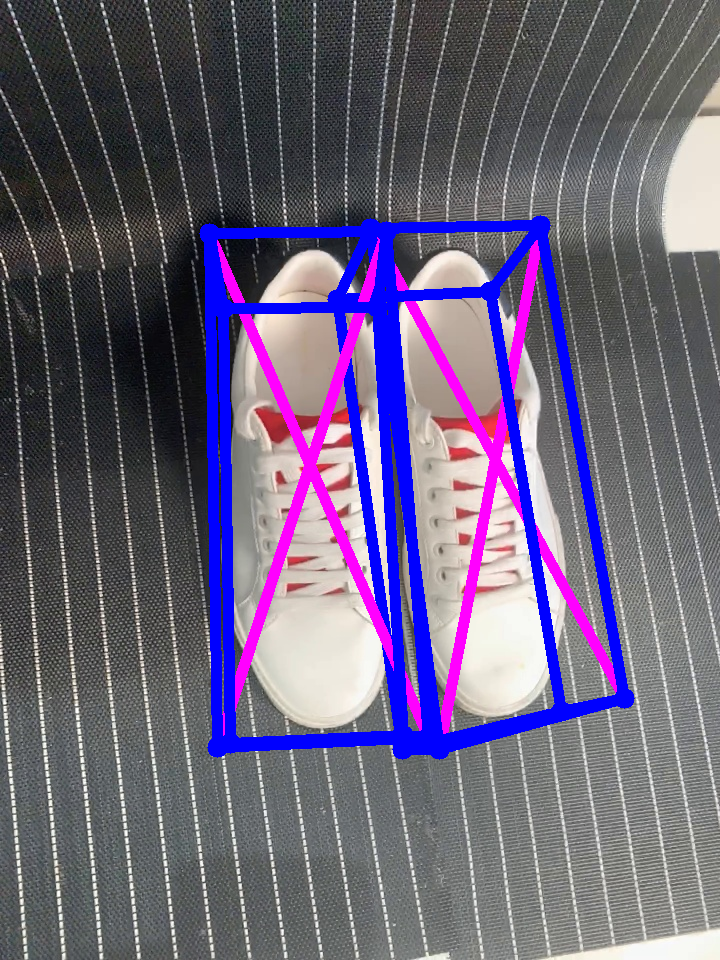

# objectron-3d-object-detection-openvino

## Input


(Image from Objectron Dataset https://github.com/google-research-datasets/Objectron/blob/master/notebooks/Download%20Data.ipynb)

Shape : (1, 3, 640, 480)

## Output



## Usage
Automatically downloads the onnx and prototxt files on the first run.
It is necessary to be connected to the Internet while downloading.

For the sample image,
```bash
$ python3 objectron-3d-object-detection-openvino.py
```

If you want to specify the input image, put the image path after the `--input` option.  
You can use `--savepath` option to change the name of the output file to save.
```bash
$ python3 objectron-3d-object-detection-openvino.py --input IMAGE_PATH --savepath SAVE_IMAGE_PATH
```

By adding the `--video` option, you can input the video.   
If you pass `0` as an argument to VIDEO_PATH, you can use the webcam input instead of the video file.
```bash
$ python3 objectron-3d-object-detection-openvino.py --video VIDEO_PATH
```

You can specify the "model type" by specifying after the `--model` option.
The model type is selected from "sneaker", "chair".  
```bash
$ python3 objectron-3d-object-detection-openvino.py --model sneaker
```

## Reference

- [objectron-3d-object-detection-openvino](https://github.com/yas-sim/objectron-3d-object-detection-openvino)
- [PINTO_model_zoo](https://github.com/PINTO0309/PINTO_model_zoo)

## Framework

TensorFlow

## Model Format

ONNX opset=11

## Netron

[object_detection_3d_sneakers.onnx.prototxt](https://netron.app/?url=https://storage.googleapis.com/ailia-models/objectron-3d-object-detection-openvino/object_detection_3d_sneakers.onnx.prototxt)  
[object_detection_3d_chair.onnx.prototxt](https://netron.app/?url=https://storage.googleapis.com/ailia-models/objectron-3d-object-detection-openvino/object_detection_3d_chair.onnx.prototxt)
